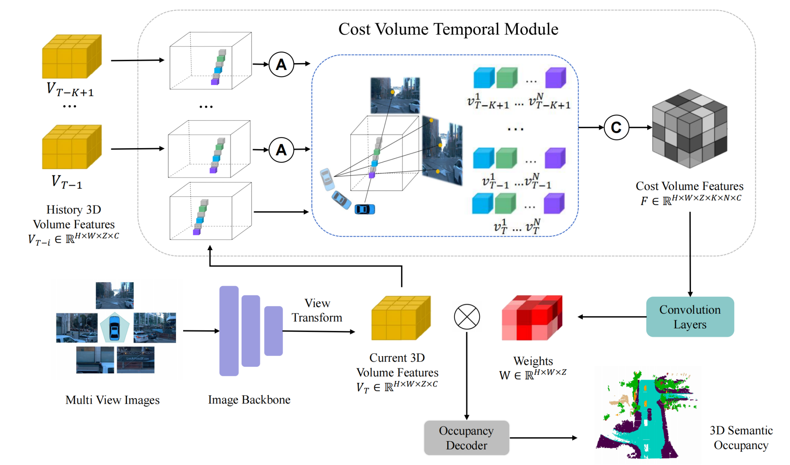

# [ECCV'24] CVT-Occ: Cost Volume Temporal Fusion for 3D Occupancy Prediction

Zhangchen Ye<sup>1*</sup>, Tao Jiang<sup>1,2*</sup>, Chenfeng Xu<sup>3</sup>, Yiming Li<sup>4</sup>, and Hang Zhao<sup>1,2,5&#x2709;</sup>

<sup>1</sup>IIIS, Tsinghua University  <sup>2</sup>Shanghai AI Lab  <sup>3</sup>UC Berkeley  <sup>4</sup>New York University  <sup>5</sup>Shanghai Qi Zhi Institute



## News
- [2024/09/23]: The preprint version is available on [arXiv](https://arxiv.org/abs/2409.13430).

- [2024/07/29]: Code Released.

- [2024/07/04]: Our paper has been accepted by [ECCV2024](https://eccv2024.ecva.net/).

## Abstract
Vision-based 3D occupancy prediction is significantly challenged by the inherent limitations of monocular vision in depth estimation. This paper introduces CVT-Occ, a novel approach that leverages temporal fusion through the geometric correspondence of voxels over time to improve the accuracy of 3D occupancy predictions. By sampling points along the line of sight of each voxel and integrating the features of these points from historical frames, we construct a cost volume feature map that refines current volume features for improved prediction outcomes. Our method takes advantage of parallax cues from historical observations and employs a data-driven approach to learn the cost volume. We validate the effectiveness of CVT-Occ through rigorous experiments on the Occ3D-Waymo dataset, where it outperforms state-of-the-art methods in 3D occupancy prediction with minimal additional computational cost.

## Get Started
- [install.md](docs/install.md)
- [dataset.md](docs/dataset.md)
- [trainval.md](docs/trainval.md)

## Model Zoo

All model weights can be download from  [HERE](https://drive.google.com/drive/folders/1m3r4VrjY1G8N-h7NVyUDc0oOI5g8f7nT?usp=sharing)

### Occ3D-Waymo

| Method             | mIoU  | Go    | Vehicle | Pedestrian | Sign  | Bicyclist | Traffic Light | Pole  | Cons. Cone | Bicycle | Building | Vegetation | Tree Trunk | Road  | Walkable |
|---------------------|-------|-------|---------|------------|-------|-----------|---------------|-------|------------|---------|----------|------------|------------|-------|----------|
| [BEVFormer-w/o TSA](projects/configs/cvtocc/bevformer_wotsa_waymo.py)   | 23.87 | **7.50** | 34.54   | 21.07      | 9.69  | **20.96** | 11.48         | 11.48 | 14.06      | 14.51   | 23.14    | 21.82      | 8.57       | 78.45 | 56.89    |
| [BEVFormer](projects/configs/cvtocc/bevformer_waymo.py)       | 24.58 | 7.18  | 36.06   | 21.00      | 9.76  | 20.23     | 12.61         | 14.52 | 14.70      | 16.06   | 23.98    | 22.50      | 9.39       | 79.11 | 57.04    |
| [SOLOFusion](projects/configs/cvtocc/solofusion_waymo.py)     | 24.73 | 4.97  | 32.45   | 18.28      | 10.33 | 17.14     | 8.07          | 17.83 | 16.23      | 19.30   | **31.49**| **28.98**  | **16.93**  | 70.95 | 53.28    |
| [BEVFormer-WrapConcat](projects/configs/cvtocc/bevformer_wrapconcat_waymo.py)  | 25.07 | 6.20  | 36.17   | 20.95      | 9.56  | 20.58     | **12.82**     | 16.24 | 14.31      | 16.78   | 25.14    | 23.56      | 12.81      | 79.04 | 56.83    |
| [CVT-Occ (ours)](projects/configs/cvtocc/cvtocc_waymo.py)      | **27.37** | 7.44  | **41.00** | **23.93** | **11.92** | 20.81     | 12.07         | **18.03** | **16.88**| **21.37**| 29.40    | 27.42      | 14.67      | **79.12** | **59.09** |

### Occ3D-NuScenes

| Method             | mIoU  | others | barrier | bicycle | bus  | car  | Cons. vehicle | motorcycle | pedestrian | traffic cone | trailer | truck | Dri. Sur | other flat | sidewalk | terrain | manmade | vegetation |
|---------------------|-------|--------|---------|---------|------|------|---------------|------------|------------|--------------|---------|-------|----------|------------|----------|---------|---------|------------|
| [BEVFormer-w/o TSA](projects/configs/cvtocc/bevformer_wotsa_nuscenes.py) | 38.05 | 9.11   | 45.68    | 22.61    | 46.19 | 52.97 | 20.27        | 26.5      | 26.8      | 26.21        | 32.29   | 37.58 | 80.5    | 40.6      | 49.93    | 52.48   | 41.59   | 35.51      |
| [BEVFormer](projects/configs/cvtocc/bevformer_nuscenes.py)  | 39.04 | **9.57**   | 47.13   | 22.52   | 47.61 | 54.14| 20.39        | 26.44      | 28.12      | 27.46        | 34.53   | 39.69 | 81.44    | **41.14**  | 50.79    | 54.00   | 43.08   | 35.60      |
| [CVT-Occ (ours)](projects/configs/cvtocc/cvtocc_nuscenes.py)     | **40.34**| 9.45  | **49.46**  | **23.57**  | **49.18** | **55.63**| **23.1**         | **27.85**      | **28.88**      | **29.07**        | **34.97**   | **40.98** | **81.44**    | 40.92      | **51.37**    | **54.25**   | **45.94**   | **39.71**      |

## Acknowledgement

Thanks to these excellent open source projects:

- [Occ3D](https://github.com/Tsinghua-MARS-Lab/Occ3D/) 
- [SOLOFusion](https://github.com/Divadi/SOLOFusion)

## Citation

If you find our work useful for your research, please consider citing the paper:

```
@article{ye2024cvt,
  title={CVT-Occ: Cost Volume Temporal Fusion for 3D Occupancy Prediction},
  author={Ye, Zhangchen and Jiang, Tao and Xu, Chenfeng and Li, Yiming and Zhao, Hang},
  journal={arXiv preprint arXiv:2409.13430},
  year={2024}
}
```
